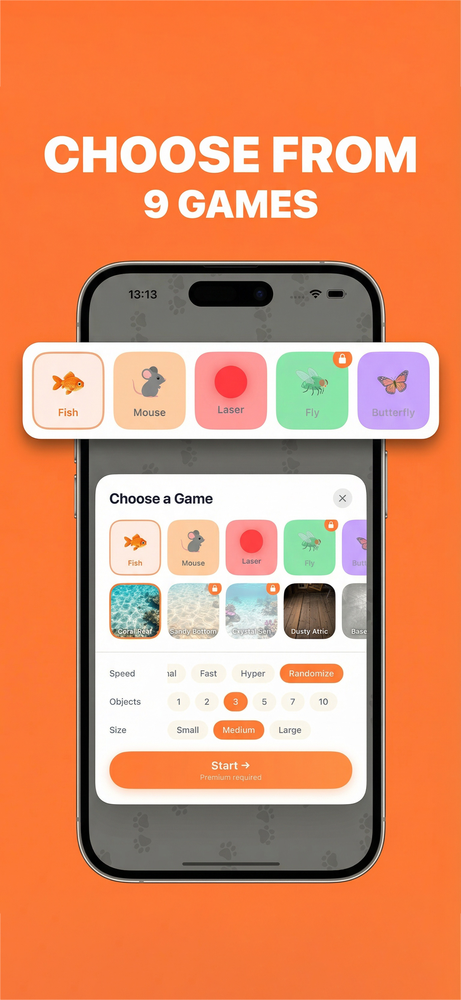
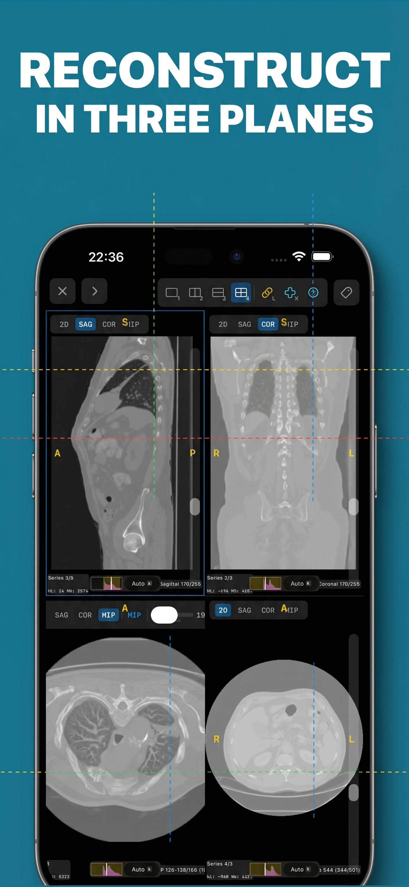
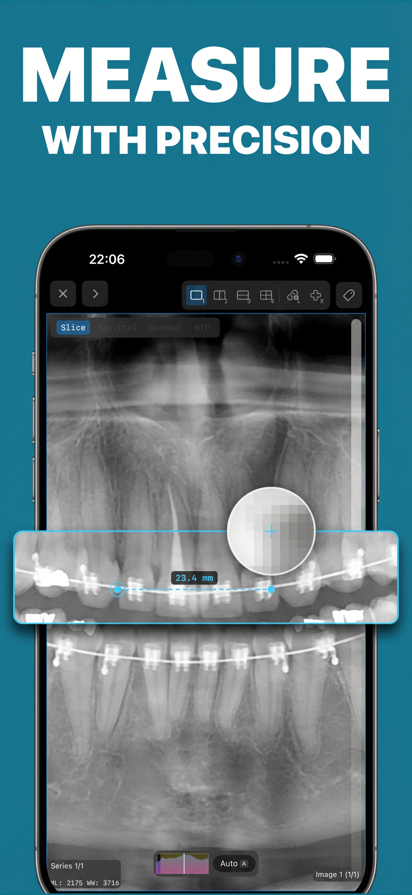

# Automate App Store Screenshots with Claude Code + Nano Banana Pro

Generate high-converting App Store screenshots end-to-end from the command line. One Claude Code skill drives the whole pipeline — analysing your app's codebase, drafting the benefit headlines, composing pixel-perfect scaffolds, and enhancing them with Google's Nano Banana Pro image model via fal.ai.

**All you need:**
- Claude Code (CLI)
- A fal.ai API key ($0.06–0.12 per final screenshot)
- A few minutes to capture simulator screenshots

No Photoshop, no Figma, no Canva, no third-party ASO tool. Everything stays in the terminal.

## Credit + why this fork exists

This is a reworked version of the original ASO screenshot skill by **[Adam Lyttle](https://www.threads.com/@adamlyttleapps)** ([@adamlyttleapps](https://github.com/adamlyttleapps) on GitHub, same handle on Threads). All credit for the core idea — local scaffold + image-model enhancement + style template for set consistency — goes to him.

What's different here:
- **fal.ai instead of Gemini MCP.** The original invoked Google's Gemini API via an MCP server. That path is blocked for users in Russia (no direct Google AI access), so this version routes Nano Banana Pro through [fal.ai](https://fal.ai) — same underlying model, different provider, works anywhere.
- **iPad support.** The original targeted iPhone 6.7" only. This fork adds a full iPad pipeline (12.9" / 13" Pro) with a matching device frame template, `--device ipad` flag on `compose.py`, 3:4 aspect ratio, and auto-pad to exact 2064×2752 / 2048×2732.
- **Auto-resize to exact App Store dimensions.** Nano Banana outputs 9:16 / 3:4 at fixed 2K; this pipeline pads to exact Apple dimensions with the brand colour so no Photoshop crop is needed.
- **Canonical storage convention.** All ASO artefacts live in `~/Developer/screenshots/{AppName}/` with `source/scaffolds/variants/final` subdirs — project repos stay clean.

---

## Examples

Three real screenshots generated with this skill:

| PAW — CHOOSE 9 GAMES | MedScan — RECONSTRUCT | MedScan — MEASURE |
|---|---|---|
|  |  |  |

Each is a single API call + a local compose step. ~60 seconds, ~$0.06–0.12 depending on variant count.

---

## How it works

```
1. RECALL        — check memory for prior runs (resume if in progress)
2. DISCOVERY     — analyse codebase, draft 3–5 action-verb benefit headlines
3. PAIRING       — rate simulator screenshots, pair each with a benefit
4. BRAND COLOUR  — auto-pick conversion-friendly bg colour from app palette
5. SCAFFOLD      — compose.py renders 1290×2796 (iPhone) / 2064×2752 (iPad)
                   with exact text, device frame, and your screenshot inside
6. ENHANCE       — scaffold → fal.ai Nano Banana Pro → photorealistic frame
                   + floating breakout panel + drop shadow, 3 variants
7. RESIZE        — auto-pad/scale to exact App Store dimensions, no crop
8. REPEAT        — first approved screenshot becomes the style template for
                   the rest of the set, guaranteeing visual cohesion
```

The critical design choice: a **local deterministic scaffold** locks layout/text/colour BEFORE the model runs. The model only adds polish (frame photorealism, breakout panels, shadows), so every screenshot in your set looks like part of the same series.

---

## Install

1. Clone this repo and copy the skill to your Claude Code skills directory:
   ```bash
   git clone https://github.com/dsm5e/screenshot-claude-with-banana.git
   mkdir -p ~/.claude/skills/aso-appstore-screenshots
   cp -r screenshot-claude-with-banana/skill/* ~/.claude/skills/aso-appstore-screenshots/
   ```

2. Get a fal.ai API key at <https://fal.ai/dashboard> and export it:
   ```bash
   export FAL_KEY="your-key-here"
   ```
   (add to `.zshrc` to persist)

3. Install Python deps (one-time):
   ```bash
   pip install Pillow
   ```

4. In your app's project folder, run Claude Code and invoke the skill:
   ```
   /aso-appstore-screenshots
   ```

Claude will walk you through benefit discovery, ask for simulator screenshots, and generate the set. Approved finals land in `~/Developer/screenshots/{AppName}/final/iphone|ipad/` at exact App Store dimensions, ready to upload.

---

## Supported sizes

| Device | Dimensions | fal.ai ratio | Post-process |
|---|---|---|---|
| iPhone 6.7" | 1290×2796 | 9:16 | auto-pad to exact |
| iPhone 6.9" | 1320×2868 | 9:16 | auto-pad to exact |
| iPad 13" Pro | 2064×2752 | 3:4 | auto-pad to exact |
| iPad 12.9" | 2048×2732 | 3:4 | auto-pad to exact |

The padding is done with your chosen brand colour — it's invisible on the final image because the scaffold already uses that same colour as the background. Zero content is cropped.

---

## Tech stack

- **Claude Code** — orchestrator + prompt author (writes the Nano Banana prompts based on your app's benefits)
- **Nano Banana Pro** (Gemini 3 Pro Image Edit) via fal.ai — photorealistic device frames + breakout panels
- **Pillow (PIL)** — scaffold composition and final resize/pad
- **Python 3.10+**

That's it. No Node, no Figma plugins, no SaaS.

---

## Cost

- Scaffold: $0 (local Python)
- Enhancement: ~$0.02–0.04 per fal.ai call (Nano Banana Pro 2K)
- Typical set: 4 benefits × 1–3 variants = **$0.08–0.48 total**

Compare to $50+/month for ASO tools that still require manual Photoshop work.

---

## Why this approach

Most ASO screenshot tools give you either rigid templates (samey results) or a blank canvas (you're designing manually). This skill splits the problem:

- **Structure** (text, layout, device position, colour) is deterministic and local — guaranteed consistent across your set, no model drift.
- **Polish** (realistic frame, floating breakout panels, shadows, lighting) is handled by a purpose-built image edit model that follows your prompt precisely.

The result: screenshots that look designed by an agency, generated in a terminal, for under a dollar a set.

---

## Links

- Nano Banana Pro on fal.ai: <https://fal.ai/models/fal-ai/gemini-3-pro-image-preview>
- Claude Code: <https://claude.com/claude-code>
- Apple's screenshot specs: <https://developer.apple.com/help/app-store-connect/reference/screenshot-specifications/>

---

## License

MIT. Use it, fork it, ship it.
